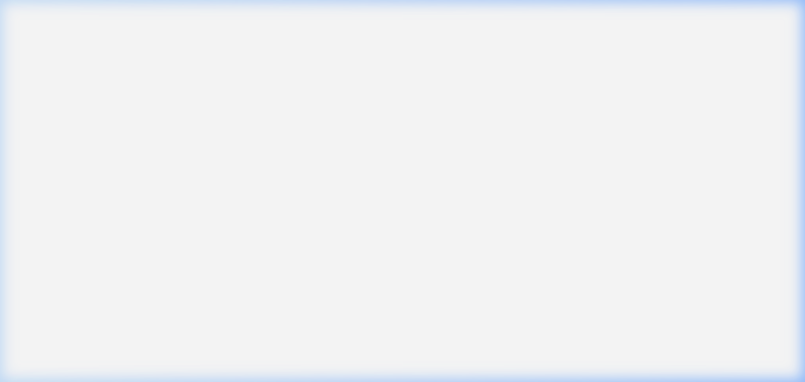
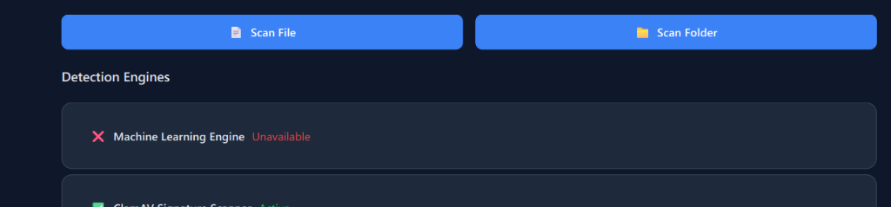
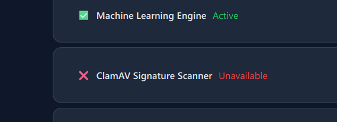

# 🛡️ Livware - AI-Hybrid Antivirus Suite

**Livware** is a state-of-the-art, high-performance antivirus engine designed for modern Windows environments. It bridges the gap between traditional signature-based detection and modern behavioral heuristics using a unique **Tri-Engine** architecture.



## 🚀 Key Features

### 🧠 1. AI-Driven Heuristics
Powered by a **LightGBM Gradient Boosting Model**, Livware analyzes the structure of PE files to detect zero-day threats that traditional signatures might miss. It extracts headers and section entropy to determine risk with surgical precision.

### 🔍 2. Signature & Rule Engines
*   **ClamAV Integration:** Leverages the world-class ClamAV database for known virus signatures.
*   **YARA Rule sets:** Implements customizable rule-based detection for advanced threat hunting.

### 🧪 3. Static Static Sandbox (Behavioral Analysis)
Before execution, suspicious files are passed through our **Behavioral Analysis Sandbox**. It inspects:
*   **Suspicious API Calls:** Hooks, Keylogging, and Injection attempts.
*   **Embedded Strings:** Detects hardcoded URLs, IPs, and ransomware ransom notes.
*   **Section Entropy:** Identifies packed or encrypted malware through mathematical calculation.



### 🖥️ 4. Full System & Quick Scanning
Intelligent scanning modules allow for:
*   **Quick Scan:** Focuses on the most targeted areas like AppData, Downloads, and Temp folders.
*   **Full Scan:** Multi-threaded recursive discovery across all system drives.



## 🏗️ Architecture

Livware is built on a modular Python stack optimized for performance and safety:
*   **UI Core:** PyQt6 with a custom Glassmorphic Dark Theme.
*   **PE Parsing:** `pefile` for deep inspection of executable metrics.
*   **Persistence:** A lightweight JSON-based memory system for scan history and logs.
*   **Multithreading:** Dedicated `QThread` workers ensure the UI remains buttery smooth even during deep system scans.

## 🛠️ How it Works

1.  **File Discovery:** The engine identifies scannable binaries (`.exe`, `.dll`, `.scr`, etc.).
2.  **Signature Check:** Files are checked against the ClamAV and YARA databases.
3.  **ML Inference:** The LightGBM model predicts the risk score based on structural features.
4.  **Auto-Sandbox:** If the risk score is high but not conclusive, the Sandbox Analyzer is triggered to confirm the threat via behavioral patterns.
5.  **Final Verdict:** Findings are aggregated into a single, user-friendly report.

## 📦 Building from Source

To compile the application into a standalone Windows executable:

1.  Ensure you have Python 3.11+ installed.
2.  Install dependencies:
    ```bash
    pip install -r requirements.txt
    ```
3.  Run the professional build script:
    ```bash
    python build_exe.py
    ```
    The compiled application will be available in the `dist/Livware` directory.

---
Developed with ❤️ by the **Livware Security Team**.
